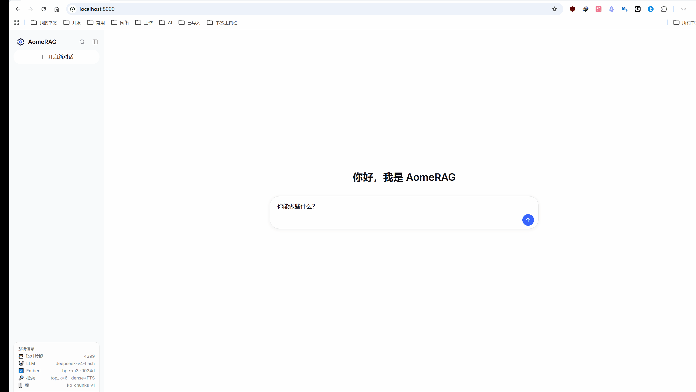
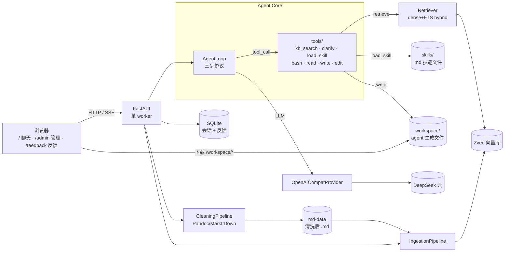
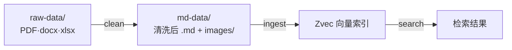

# AomeRAG

> 公司私域知识库的 **Agentic RAG** 系统：一个 agent 在循环里自己决定何时加载技能、何时检索知识库、何时向用户追问，并依据检索到的内容组织成回答。后端 Python + FastAPI，前端 React，单进程即可同时服务 API 与页面。

这份 README 分两部分：**先一份小白也能懂的大白话**，**再一份给开发者的专业详解**。挑你看的下去的那份读。

---



## 目录

- [基础介绍](#基础介绍)
- **专业详解**
  - [1. 项目简介](#1-项目简介)
  - [2. 技术栈](#2-技术栈)
  - [3. 架构总览](#3-架构总览)
  - [4. 数据管线（清洗→切片→索引→检索）](#4-数据管线清洗切片索引检索)
  - [5. Agent 引擎（循环·工具·生成）](#5-agent-引擎循环工具生成)
  - [6. Skill 系统（tools/ 引擎 + skills/ 数据）](#6-skill-系统tools-引擎--skills-数据)
  - [7. 多用户会话 + 反馈系统 + SSE 流式](#7-多用户会话--反馈系统--sse-流式)
  - [8. 管理页面（/admin + /feedback）](#8-管理页面admin--feedback)
  - [9. 目录结构](#9-目录结构)
  - [10. 快速开始](#10-快速开始)
  - [11. 配置项](#11-配置项)
  - [12. 测试](#12-测试)
  - [13. 设计决策](#13-设计决策)

---

# 基础介绍

**一句话**：AomeRAG 是一个「会自己查资料、不瞎编、还能反问你」的公司内部问答助手。

- **RAG = 开卷考试**：AI 答题前先翻你给它的资料（知识库），照着资料答，附来源出处。
- **清洗 = 把原始文件（PDF/docx）转成 Markdown**：Word 用 Pandoc、其它用 MarkItDown，图片抽出来转 PNG。
- **切片 = 把资料拆成小卡片**：按标题切，方便查找。
- **索引 = 给卡片建语义目录**：按"意思像不像"和"关键词命中"两种方式建索引。
- **检索 = 找最相关的卡片**：两种找法同时用，混合排序。
- **Agent = 会动脑的助手**：自己判断问题清不清楚→先查技能→再搜知识库→不够就反问你。
- **Skill = 助手会的技能**：检索、追问、加载 API 文档都是技能；丢一个 `.md` 文件进去就多一项能力。
- **工作区 = 能干活的助手**：还能读写/执行 `workspace/` 里的文件（如生成测试脚本）；生成的整套文件打包成 zip，客户点链接即可下载。
- **反馈 = 质量闭环**：每条回答可以👍/👎；知识库没找到时可以补充反馈；管理员在 `/feedback` 页面统一查看。

**四步上手**：

1. **清洗**：把原始文件（PDF/docx）放 `raw/raw-data/`，调 `/clean/dir` → 输出到 `raw/md-data/`（带 front-matter + 图片）。
2. **切片入库**：调 `/ingest/dir` → 把 md-data 切片 → 向量索引。
3. **提问**：在聊天页面问，Agent 先判断清晰度 → 加载技能 → 检索知识库 → 流式回答。
4. **管理**：`/admin` 管数据管线 + 系统信息；`/feedback` 看用户反馈。

> 以上操作都可以在 `http://localhost:8000/admin` 页面点按钮完成，不用敲命令。

---

# 专业详解

## 1. 项目简介

第 3 档 Agentic RAG（借鉴 [learn-claude-code](https://github.com/shareAI-lab/learn-claude-code) 的 s01 loop / s02 工具派发 / s07 按需技能加载）：

- **三步协议**：① 判断清晰度（不清→clarify）→ ② 先查技能（load_skill）→ ③ 再搜知识库（kb_search）。
- **清洗管线**：`raw-data`（PDF/docx 原始文件）→ Pandoc/MarkItDown + 图片提取 → `md-data`（带 YAML front-matter 的 .md）。
- **多人并发**：单后端服务器扛并发，会话历史按用户隔离。
- **反馈系统**：👍/👎 评分 + 知识库缺失补充 → SQLite 存储 → `/feedback` 管理页面。
- **可扩展**：技能丢 `.md` 文件即扩展；系统提示词外部 `.md` 可手编。
- **三个页面**：`/`（聊天）+ `/admin`（管理后台）+ `/feedback`（反馈管理）。

## 2. 技术栈

**后端**（`src/aome_rag/`）：Python 3.11+ · FastAPI + uvicorn（**单 worker**）· Pydantic v2 · DeepSeek（OpenAI 兼容）· Ollama `bge-m3` · [Zvec](https://github.com/alibaba/zvec) · **Pandoc**（docx 清洗）· markitdown · **Pillow**（图片转 PNG）· requests · aiosqlite · structlog · pytest（**151 测试**）。

**前端**（`web/`）：React 18 + TypeScript · **react-router-dom**（`/` + `/admin` + `/feedback`）· Vite 6 · Tailwind v4 · react-markdown + remark-gfm + **rehype-highlight**（11 语言语法高亮）· lucide-react。

## 3. 架构总览



**并发模型**：Zvec 写单进程独占 → `workers=1`；Zvec 同步调用走线程池；DeepSeek/Ollama 走 async HTTP；摄入写加 `asyncio.Lock`；semaphore 限并发。

---

## 4. 数据管线（清洗→切片→索引→检索）



### 4.0 清洗 Clean（raw-data → md-data）

`POST /clean/dir`（SSE）：递归扫 `RAW_DATA_DIR` → 全量重生成 `MD_DATA_DIR`。

- **`.docx` → Pandoc**（subprocess，`--extract-media` 抽图）；**其它 → MarkItDown**；**`.md` 直读**。
- **图片处理**：Pandoc 抽出的本地图 + md 里 `data:base64` + `http://` 远程图 → Pillow 转 PNG → `md-data/images/image_<%Y%m%d%H%M%S%f>.png` → md 用相对路径引用。Pillow 打不开的（EMF/WMF）跳过。
- **YAML front-matter**：每个 .md 头部含 `title`（文件名）/ `date`（生成日期）/ `author`/`description`/`tags`（空）。
- **全量重生成**：每次 clean 清空 md-data 再重建。

### 4.1 加载 Load（切片入口）

`POST /ingest/dir`（SSE）：递归扫 `MD_DATA_DIR`（排除 `images/` 目录）→ 按扩展名路由（`.md` 直读）→ 切片 → embedding → Zvec。每文件**先删后插**（幂等，重切无残留）。

### 4.2 切分 Chunk

结构化优先（按 Markdown 标题层级切）+ 定长兜底（`target=1200 / max=1600 / overlap=200`）。短文档退化为整篇 1 块。

### 4.3 索引 Index

bge-m3 dense(1024) → Zvec collection（HNSW cosine + FTS + Invert 三索引）。chunk id = `sha1(source_doc)[:16]#index`（Zvec 安全）。

### 4.4 检索 Retrieve

dense + FTS 双通道 → RRF 融合 → top_k Hit（带 source_doc/heading_path/page/score）。

> Ollama 只吐 dense → 关键词通道用 Zvec 原生 FTS（非 bge-m3 sparse）。

---

## 5. Agent 引擎（循环·工具·生成）

**三步协议**（system prompt 定义，可手编 `prompt/system-prompt.md`）：

1. **判断清晰度** → 缺关键信息（型号/信号类型/术语）→ `clarify`（问一个聚焦问题，EndTurn 停本轮）。
2. **先查技能** → 有匹配技能（如 pg-lua-recipe）→ `load_skill("name")` 加载 .md 全文到上下文。
3. **再搜知识库** → `kb_search(query)` 混合检索；连续 2 次不相关就停。

工具集（注册在 `tools/`）：
- `kb_search` — 知识库检索（hybrid）。
- `clarify` — 追问用户（EndTurn）。
- `load_skill` — s07 按需加载 .md 技能（SkillLoaderSkill，每轮动态扫描 skills/）。
- `bash` / `read` / `write` / `edit` — **内置工作区工具**：只读写 `WORKSPACE_DIR`（默认 `./workspace`），bash 跑 PowerShell（cwd=workspace，30s 超时）。`read` 额外可读 skill 的参考/模板文件（`@skill/<name>/<子目录>/<file>`，只读，支持 `#标题` 按段落读）。所有调用写入审计日志（`logs/app/tools.log`，含 user + session）。

`MAX_ITERATIONS`（默认 12，本地 `.env` 常设 500，部署包设 **50**）；`load_base_prompt()` 每轮从 `prompt/system-prompt.md` 读取（实时生效）。

### 工作区与下载（workspace）

- agent 生成的整套文件（如 pg-lua-recipe 的 Recipe）写入 `workspace/`，服务以 **`/workspace` 静态挂载**供浏览器直接下载。
- 技能会打包生成目录为 `Recipe_<规格>.zip` 并在回答里给出可点击下载链接（`/workspace/<目录名>.zip`）。
- `WORKSPACE_RETENTION_DAYS`（默认 7）：服务启动时自动清理超过保留期的生成文件。

---

## 6. Skill 系统（tools/ 引擎 + skills/ 数据）

**`src/aome_rag/tools/`** = Python 引擎（`Skill` 协议 + `SkillRegistry` + kb_search + clarify + skill_loader）。

**`src/aome_rag/skills/`** = .md 技能数据文件（Claude Code 式）：
- 目录式：`skills/<name>/SKILL.md`（+ 可选 `references/`、`assets/`）。
- 独立式：`skills/<name>.md`。
- SkillLoaderSkill 每轮扫描，system prompt 按 **frontmatter `description`（触发条件）** 列出技能目录（`name: 描述`）；模型命中后调 `load_skill(name)` → 全文注入上下文。
- 技能内的参考/模板文件由 `read` 工具读取：`@skill/<name>/references|assets/<file>`，可用 `#标题` 只读某段落。
- **内置技能**：`pg-lua-recipe`（PG 图案发生器 Lua Recipe 开发，含 RecipeTemplate + API 参考）、`products`（电测产品履历查询）。
- 加新技能 = 丢 .md 文件，下一轮自动生效。

**系统提示词**：`src/aome_rag/prompt/system-prompt.md`（可手编，每轮重读实时生效）。

---

## 7. 多用户会话 + 反馈系统 + SSE 流式

**会话**（SQLite WAL）：每条消息存完整内部 Message（JSON），按 user_id 隔离。首轮后 LLM 自动生成 ≤15 字标题。

**反馈系统**（SQLite `feedback` 表）：
- **👍/👎**：每条 AI 回答旁；👎 弹内联对话框输入评论。存完整上下文（提问 + 回答 + 评分 + 评论）。
- **知识库缺失补充**：kb_search 返回 0 条时显示「点击补充」按钮 → 用户输入期望找到的内容。
- `POST /feedback` 提交；`GET /admin/feedback/all` 列出（admin）；`DELETE /admin/feedback/{id}` 删除。

**SSE 事件**：`session` / `token` / `tool_start` / `tool_result`（含 `details` 结构化命中 + `cancelled` 标记）/ `clarify` / `final` / `error`。

**工具状态 UI**：进行中显示「正在生成/当前动作 + 实时用时」（秒数跳动，避免长任务误以为卡死）；完成后聚合为一条「知识库检索 · N 条 · 用时 X.X 秒」或「已使用 N 个工具」+ 可折叠详情面板（chevron 箭头）。历史消息只最后一条显示状态条，空消息不渲染；回答里的裸 `/workspace/` 路径自动转成可点击下载链接。

**消息持久化**：clarify 问题文本写入 assistant 消息 blocks，回看历史时 toolEvents 从 ToolUseBlock + ToolResultBlock 重建。

---

## 8. 管理页面（/admin + /feedback）

**`/admin`**（AdminPage）：
- 数据管线：清洗（/clean/dir SSE）+ 切片（/ingest/dir SSE）。
- 系统信息：stats + readyz（自动刷新）。
- 文件浏览：raw-data / md-data 列表。
- 向量库：清空（danger zone + 确认）。
- 会话管理：跨用户列表 + 删除。
- 链接到 /feedback。

**`/feedback`**（FeedbackPage）：
- 所有反馈卡片列表（类型标签 / 时间 / 用户 / 提问 / AI 回答 / 评论）。
- 「查看详情」展开完整内容。
- 🗑 删除单条反馈。

---

## 9. 目录结构

```
AomeCode/
├─ src/aome_rag/
│  ├─ main.py                    # FastAPI 工厂 + lifespan（aomerag 入口）
│  ├─ config.py                  # Pydantic Settings
│  ├─ __main__.py                # aomerag CLI（锁死单 worker）
│  ├─ prompt/system-prompt.md    # 可手编系统提示词（实时生效）
│  ├─ providers/                 # LLM 抽象（OpenAI 兼容适配器）
│  ├─ agent/                     # loop / events / context
│  ├─ tools/                     # Skill 引擎：base / registry / kb_search / clarify / skill_loader / workspace
│  ├─ skills/                    # .md 技能数据（pg-lua-recipe/、products/）
│  ├─ retrieval/                 # Zvec hybrid 检索
│  ├─ ingestion/                 # 切片 + 向量化 + upsert
│  ├─ cleaning/                  # Pandoc/MarkItDown 清洗 + 图片 + front-matter
│  ├─ session/                   # SQLite 会话 + 反馈
│  └─ api/                       # routes_{chat,ingest,clean,session,admin,feedback,health}
├─ web/                          # React + Vite + TS + Tailwind
│  ├─ src/components/chat/       # ChatApp / Sidebar / Composer / MessageList（👍/👎）
│  ├─ src/components/admin/      # AdminPage / FeedbackPage
│  └─ src/lib/api.ts             # 统一 API 客户端（SSE + auth）
├─ raw/
│  ├─ raw-data/                  # 原始文件（PDF/docx/xlsx）
│  └─ md-data/                   # 清洗输出（.md + images/）
├─ workspace/                    # agent 工作区（生成文件，/workspace 下载，按保留期清理）
├─ logs/                         # 服务器日志（app/ + access/，按天轮转）
├─ tests/                        # unit / integration（151 测试）
└─ pyproject.toml  .env.example  README.md
```

---

## 10. 新电脑搭建指南（从零开始）

### 10.1 系统要求

- **OS**：Windows 10/11、Linux、macOS
- **Python**：3.11+（推荐 3.12）
- **Node.js**：18+
- **Pandoc**：3.x（docx 清洗用）
- **Ollama**：最新版（本地 embedding 模型）
- **Git**（克隆仓库）

### 10.2 安装前置软件

#### Windows（PowerShell 管理员）

```powershell
# 1. Python 3.12（如已装跳过）
winget install Python.Python.3.12

# 2. uv（Python 包管理器）
winget install astral-sh.uv

# 3. Node.js 18+
winget install OpenJS.NodeJS.LTS

# 4. Pandoc（docx 清洗）
winget install JohnMacFarlane.Pandoc

# 5. Ollama（embedding 模型运行时）
winget install Ollama.Ollama

# 6. Git
winget install Git.Git
```

#### Linux（Ubuntu/Debian）

```bash
# Python 3.12
sudo apt update && sudo apt install python3.12 python3.12-venv

# uv
curl -LsSf https://astral.sh/uv/install.sh | sh

# Node.js 18+
curl -fsSL https://deb.nodesource.com/setup_18.x | sudo -E bash -
sudo apt install nodejs

# Pandoc
sudo apt install pandoc

# Ollama
curl -fsSL https://ollama.com/install.sh | sh

# Git
sudo apt install git
```

### 10.3 拉取模型 & 获取 API Key

```bash
# 拉取 bge-m3 embedding 模型（约 1.2GB，首次需要几分钟）
ollama pull bge-m3

# 确认 Ollama 在运行
ollama serve   # 或系统服务自动启动
```

**DeepSeek API Key**：去 [platform.deepseek.com](https://platform.deepseek.com/) 注册 → 创建 API Key → 复制。

### 10.4 克隆 & 配置 & 启动

```bash
# 1. 克隆仓库
git clone https://github.com/AomeNero/AomeRAG.git
cd AomeRAG

# 2. 创建 Python 虚拟环境 + 安装依赖
uv venv --python 3.12
uv pip install -e ".[dev,vec,ingest]"

# 3. 配置环境变量
cp .env.example .env
# 编辑 .env，至少填入：
#   DEEPSEEK_API_KEY=你的key
#   DEEPSEEK_MODEL=deepseek-chat   （必须支持 function-calling）

# 4. 构建前端
cd web
npm install
npm run build
cd ..

# 5. 启动！
uv run aomerag                # 默认 http://localhost:8000
# 部署时：uv run aomerag --host 0.0.0.0
```

打开浏览器：
- **聊天**：http://localhost:8000
- **管理后台**：http://localhost:8000/admin
- **反馈管理**：http://localhost:8000/feedback

### 10.5 日志

默认写入 `logs/`（`LOG_DIR` 可改，`LOG_TO_FILE=false` 可关）：

- `logs/app/*.log`：应用日志（按 api/agent/retrieval/ingestion/cleaning/session 等模块分包）+ uvicorn 生命周期/错误日志
- `logs/access/*.log`：每个 HTTP 请求的访问日志

按天一个文件，保留 `LOG_RETENTION_DAYS`（默认 30）天；`LOG_APP_TO_FILE` / `LOG_ACCESS_TO_FILE` 可分别开关。

### 10.6 导入知识库（首次使用）

在 `/admin` 页面操作，或命令行：

```bash
# 1. 把原始文件（PDF/docx/xlsx）放到 raw/raw-data/
# 2. 清洗 → raw/md-data/
curl -N -X POST -H "X-User-Id: admin" http://localhost:8000/clean/dir

# 3. 切片入库
curl -N -X POST -H "X-User-Id: admin" http://localhost:8000/ingest/dir

# 4. 提问测试
curl -X POST http://localhost:8000/chat -H "X-User-Id: alice" \
     -H "Content-Type: application/json" \
     -d '{"message":"你好","stream":false}'
```

### 10.7 常见问题

| 问题 | 解决 |
|---|---|
| `OPENSSL_ROOT_DIR` / httplib 安装失败 | Windows 装 [OpenSSL Win64 Dev](https://slproweb.com/products/Win32OpenSSL.html)，设 `OPENSSL_ROOT_DIR` 环境变量 |
| Ollama 连接失败 | 确认 `ollama serve` 在跑；检查 `OLLAMA_BASE_URL`（默认 `localhost:11434`） |
| `deepseek-v4-flash` 不支持 tools | 改 `.env` 里 `DEEPSEEK_MODEL=deepseek-chat` |
| Pandoc not found | 确认 `pandoc` 在 PATH（终端跑 `pandoc --version` 验证） |
| 中文乱码 | 确保终端/编辑器用 UTF-8；Windows PowerShell 跑 `chcp 65001` |
| cpolar 穿透报 `crypto.randomUUID` | 已修复（自动 fallback）；确保重新 `npm run build` |
| 前端页面白屏 | 确认 `npm run build` 产出了 `web/dist/`；检查 `FRONTEND_DIST` 路径 |
| `exceeded N iterations`（服务器报错） | 部署包 `.env` 的 `MAX_ITERATIONS` 太低（原 6），改成 50 后重启 |
| 服务器提示"知识库检索失败" | 服务器缺 bge-m3：`ollama pull bge-m3`（或重跑启动.bat） |
| `/workspace/xxx` 返回 404 | 确认服务是新代码（含 workspace 挂载）；`/workspace` 无目录列表，只能访问具体文件（如 `.zip`） |

### 10.8 开发模式（热重载）

```bash
# 终端 1：后端
uv run aomerag

# 终端 2：前端 dev server（热重载）
cd web && npm run dev   # http://localhost:5173
```

**数据工作流**（在 `/admin` 页面点按钮，或命令行）：

```bash
# 1. 清洗：raw-data → md-data
curl -N -X POST -H "X-User-Id: admin" http://localhost:8000/clean/dir

# 2. 切片入库：md-data → 向量索引
curl -N -X POST -H "X-User-Id: admin" http://localhost:8000/ingest/dir

# 3. 提问
curl -X POST http://localhost:8000/chat -H "X-User-Id: alice" \
     -H "Content-Type: application/json" -d '{"message":"GI328 的 PINMAP？","stream":false}'
```

**三个页面**：
- `http://localhost:8000/` — 聊天
- `http://localhost:8000/admin` — 管理后台
- `http://localhost:8000/feedback` — 反馈管理

---

## 11. 配置项

| 变量 | 默认 | 说明 |
|---|---|---|
| `DEEPSEEK_API_KEY` | — | 必填 |
| `DEEPSEEK_MODEL` | `deepseek-chat` | 必须支持 function-calling |
| `MAX_CONCURRENT_LLM` | 8 | DeepSeek 并发 |
| `OLLAMA_BASE_URL` / `OLLAMA_EMBED_MODEL` | `:11434` / `bge-m3` | |
| `EMBED_DIM` | 1024 | |
| `ZVEC_PATH` / `KB_COLLECTION` | `./data/zvec` / `kb_chunks_v1` | |
| `TOP_K` | 6 | 检索 |
| `MAX_CONCURRENT_LOOPS` / `MAX_ITERATIONS` | 16 / 12 | agent 并发与往返上限（本地常设 500，部署包 50） |
| `SQLITE_PATH` | `./data/sessions.db` | 会话 + 反馈 |
| `RAW_DATA_DIR` / `MD_DATA_DIR` | `./raw/raw-data` / `./raw/md-data` | 清洗输入/输出 |
| `FRONTEND_DIST` | `./web/dist` | 存在则后端托管前端 |
| `SKILLS_DIR` | `./skills` | drop-in Python skills（.md 在包内 skills/） |
| `WORKSPACE_DIR` | `./workspace` | agent 工作区（read/write/edit/bash 沙箱，`/workspace` 挂载下载） |
| `WORKSPACE_RETENTION_DAYS` | 7 | 启动时清理 N 天前的生成文件（≤0 禁用） |
| `LOG_DIR` / `LOG_RETENTION_DAYS` | `./logs` / 30 | 日志目录 / 按天保留天数 |
| `LOG_TO_FILE` / `LOG_APP_TO_FILE` / `LOG_ACCESS_TO_FILE` | true | 日志开关（总开关 / 应用 / 访问），false 则纯控制台 |

---

## 12. 测试

```sh
uv run pytest -q                 # unit + integration（151 测试）
uv run pytest -q -m live         # 真 DeepSeek/Ollama
```

---

## 13. 设计决策

1. 私域 KB 问答 / 多人 / 网页。
2. 第 3 档 Agentic RAG（借 s01/s02/s07）。
3. 集中式单后端；Ollama+Zvec 同机；DeepSeek 云。
4. Zvec 进程内 → 写独占 → `workers=1` + 写锁 + 线程池。
5. 原生 function-calling；DeepSeek `deepseek-chat`。
6. provider 接口先建，v1 只实现 OpenAI 适配器。
7. 检索 = dense(bge-m3) + 关键词(Zvec FTS)；重排延后。
8. 分块 = 结构化 + 定长兜底。
9. Skill = tools/ 引擎 + skills/ .md 数据（s07 按需加载）。
10. 多用户 = 共享 KB + 简单鉴权。
11. **清洗管线**：Pandoc(docx) / MarkItDown(其它) + Pillow(图片→PNG) + YAML front-matter。
12. **三步协议**：clarify → load_skill → kb_search；MAX_ITERATIONS=12。
13. **系统提示词外置** `prompt/system-prompt.md`（可手编、实时生效）。
14. **反馈系统**：👍/👎 + 缺失补充 → SQLite → /feedback 管理。
15. **检索 UI**：整体用时计时 + 可折叠详情面板；EndTurn 取消的工具标记 `cancelled`。
16. **消息持久化**：clarify 问题写入 blocks；回看历史从 ToolUseBlock + ToolResultBlock 重建 toolEvents。
17. **工作区沙箱**：bash/read/write/edit 限定 `WORKSPACE_DIR`；路径越界校验 + 全量审计日志；`/workspace` 静态挂载供下载，按 `WORKSPACE_RETENTION_DAYS` 自动清理。
18. **Skill 描述路由**：目录按 frontmatter `description`（触发条件）展示，命中才 load_skill；`read` 可读 `@skill/...` 参考文件（只读）。
19. **文件日志**：structlog 按模块分包写 `logs/app/`，访问日志写 `logs/access/`，按天轮转、保留 `LOG_RETENTION_DAYS` 天，开关可配。
