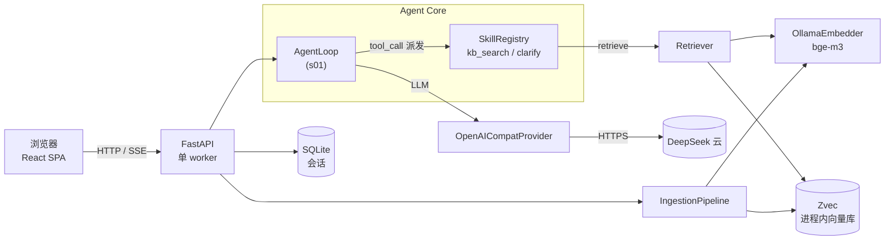
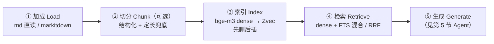
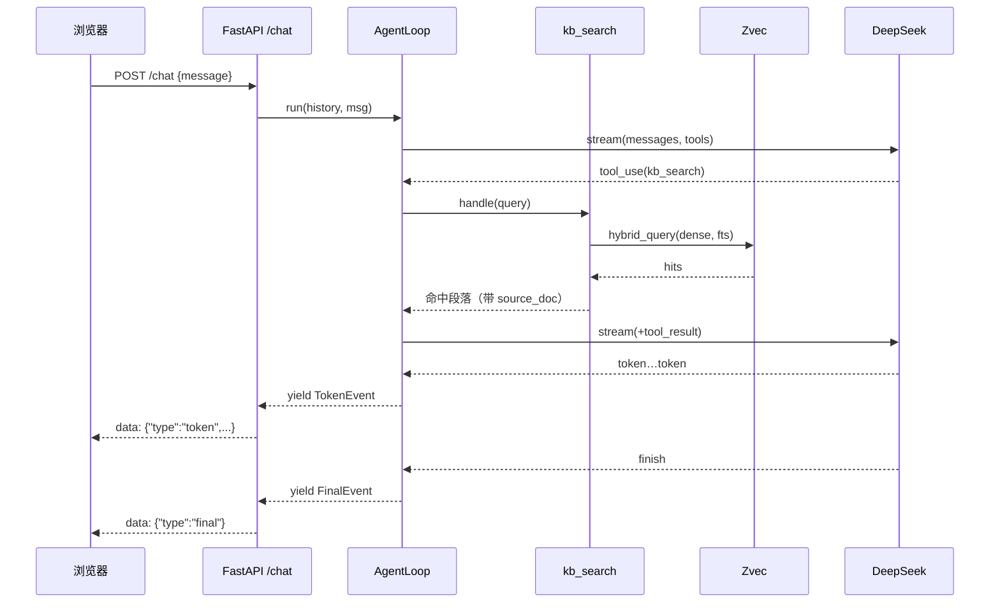

# AomeRAG

> 公司私域知识库的 **Agentic RAG** 系统：一个 agent 在循环里自己决定何时检索知识库、何时向用户追问，并依据检索到的内容组织成回答。后端 Python + FastAPI，前端 React，单进程即可同时服务 API 与页面。

这份 README 分两部分：**先一份小白也能懂的大白话**，**再一份给开发者的专业详解**。挑你看的下去的那份读。

---

## 目录

- [小白入门（大白话版）](#小白入门大白话版)
- **专业详解**
  - [1. 项目简介](#1-项目简介)
  - [2. 技术栈](#2-技术栈)
  - [3. 架构总览](#3-架构总览)
  - [4. RAG 流水线](#4-rag-流水线加载切片索引检索)
  - [5. Agent 引擎](#5-agent-引擎循环工具生成并行重点)
  - [6. Skill 系统](#6-skill-系统含最小示例)
  - [7. 多用户会话 + SSE 流式](#7-多用户会话--sse-流式)
  - [8. 目录结构](#8-目录结构)
  - [9. 快速开始](#9-快速开始)
  - [10. 配置项](#10-配置项)
  - [11. 扩展指南](#11-扩展指南)
  - [12. 测试](#12-测试)
  - [13. 设计决策](#13-设计决策)
  - [14. 路线图](#14-路线图)

---

# 小白入门（大白话版）

**一句话**：AomeRAG 是一个「会自己查资料、不瞎编、还能反问你」的公司内部问答助手。

打个比方，它像一个新来的同事 + 一个开卷考试：

- **RAG（检索增强生成）= 开卷考试**。普通 AI 是「闭卷」——凭记忆答题，容易胡说。RAG 让 AI 答题前**先翻你给它的资料**（你的知识库），照着资料答，答得上还附「这段出自哪份文档」。
- **切片 = 把厚资料拆成小卡片**。一整本手册不好查，拆成一页页小段落（卡片），找起来又快又准。
- **索引 = 给每张卡片建目录**。不光能按「关键词」查，还能按「意思像不像」查——你说「怎么部署」，它能找到写着「上线流程」的卡片。
- **检索 = 找最相关的几张卡片**。两种找法同时用：意思相近的 + 关键词命中的，混在一起排序。
- **Agent = 会自己动脑的助手**。它不是死板的「问题→搜→答」流水线；它**自己判断**：这个问题清楚吗？要不要查资料？查一次不够要不要换个词再查？信息不够就**反过来问你**「你具体想问哪个型号？」。
- **Skill = 助手会的技能**。检索、追问都是技能；想让它多会一项（比如查天气、算数），**丢一个文件进去**就行，不用改核心代码。
- **多用户**：大家共用一个资料库，但**各自的聊天记录互不可见**。

**三步上手**：

1. **启动**：`uv run uvicorn aome_rag.main:app --workers 1`（开 http://localhost:8000）。
2. **喂资料**：点页面左下「导入知识库」，或 `curl -N -X POST -H "X-User-Id: alice" http://localhost:8000/ingest/dir`。
3. **提问**：在输入框问，比如「GI328 的 PINMAP 是什么？」——看到它先「检索知识库」，再流式给出带来源的回答。

> Agency（动脑能力）来自大模型，我们造的是给它用的「载具」（工具、资料、规矩）。模型聪明，载具造好，它就能干活。

---

# 专业详解

下面的内容面向想理解 / 运行 / 扩展本项目的开发者。RAG（数据侧：加载→切分→索引→检索）与 Agent（控制侧：循环→工具→生成）是两条**并列的主线**。

## 1. 项目简介

第 3 档 Agentic RAG（借鉴 [learn-claude-code](https://github.com/shareAI-lab/learn-claude-code) 的 s01 agent loop / s02 工具派发 / s07 skill 加载）：

- **agent loop**：LLM 持有工具（`kb_search`/`clarify`），**自己决定**何时检索、检索几次、何时追问。
- **多人并发**：单后端服务器扛并发，会话历史按用户隔离。
- **可扩展**：检索与追问是 skill，丢文件即扩展，核心 loop 零改动。
- **自带前端**：React（仿 DeepSeek），生产由后端单进程托管。

## 2. 技术栈

**后端**（`src/aome_rag/`）：Python 3.11+ · FastAPI + uvicorn（**单 worker**）· Pydantic v2 · DeepSeek（`deepseek-chat`，OpenAI 兼容）· Ollama `bge-m3`（1024 维 dense）· [Zvec](https://github.com/alibaba/zvec)（进程内向量库）· markitdown（文档解析）· aiosqlite（会话）· httpx · structlog · pytest。

**前端**（`web/`）：React 18 + TypeScript · Vite 6 · Tailwind v4 · react-markdown + remark-gfm · lucide-react。

## 3. 架构总览

三层：**前端 → 传输适配（FastAPI HTTP/SSE）→ Agent Core**。`api/` 只翻译 HTTP↔内部模型，不碰 provider/检索实现；`agent/` 只认 `LLMProvider` 和 `Skill` 两个 Protocol。



**并发模型**（技术栈逼定）：Zvec 进程内 + **写单进程独占** → `workers=1`；DeepSeek/Ollama 走 async HTTP；Zvec 同步调用全丢 `ThreadPoolExecutor`；摄入写加 `asyncio.Lock`；semaphore 限并发（agent 轮数 / LLM / embedding）。

---

## 4. RAG 流水线（加载·切片·索引·检索）

RAG 是数据侧主线，把「知识」准备好、查出来。五段式中的前四段在这里；第五段「生成」交给 Agent（第 5 节）。



### 4.1 加载 Load

两条入口，都把文档变成 **Markdown 文本**。**按扩展名路由**（`ingestion/parser.py`）：`.md`/`.markdown` 直接 decode；pdf/docx/pptx/xlsx/html/txt 等走 markitdown；其余抛 `UnsupportedFile`（目录扫描时跳过告警）。`source_doc` = 文件相对 `RAW_DIR` 的路径。

**具体用法**（后端跑在 :8000，鉴权用 `X-User-Id` 头）：

```bash
# 健康检查 / 就绪探针（浏览器直接开也行）
curl http://127.0.0.1:8000/readyz
# -> {"db":"ok","zvec":"ok","retriever":"ok","provider":"ok","deepseek_key":"present"}

# ① 上传一个或多个文件（multipart）
curl -F "files=@raw/1.1 GI328系列规格书.md" \
     -F "files=@notes.pdf" \
     -H "X-User-Id: alice" \
     http://127.0.0.1:8000/ingest
# -> {"n_docs":2,"n_chunks":37,"n_failed":0,"errors":[],"elapsed_s":8.2}

# ② 切片整个 raw 目录（SSE 流式进度，-N 不缓冲）
curl -N -X POST -H "X-User-Id: alice" http://127.0.0.1:8000/ingest/dir
# data: {"type":"scan","raw_dir":"./raw","n_files":3,"n_skipped":0}
# data: {"type":"file_done","source_doc":"1.1 GI328系列规格书.md","n_chunks":18,"status":"ok"}
# ...
# data: {"type":"summary","n_docs":3,"n_chunks":42,"n_failed":0,"elapsed_s":12.3}
```

> Windows 用 `curl.exe`（不是 PowerShell 的 `curl` 别名）。文件名带空格/中文要像上面那样整体引起来。

### 4.2 切分 Chunk（可选，详细逻辑）

切分器 `ingestion/chunker.py`：**结构化优先 + 定长兜底**。默认 `target_chars=1200 / max_chars=1600 / overlap=200`（token≈chars/3-4 的粗估）。

**第一步：按标题切 section**（`_sections`）：

- 逐行扫描，正则 `^(#{1,6})\s+(.*?)$` 识别 Markdown 标题。
- 维护一个「标题栈」`[(level, title), ...]`：遇到 `## 3.2 架构`（level 2）时，先把栈里 `level ≥ 2` 的弹出，再压入；这样得到当前 section 的 **`heading_path`**（如 `第三章 > 3.2 架构`）。
- 标题之间的正文累积成 section body；遇到下一个标题就 flush 出一个 `(heading_path, body)`。

**第二步：每个 section 决定切块数**：

- `len(body) ≤ max_chars` → **整段 1 块**（这就是「可选切分」——短文档/短 section 不切，整篇当一块入库）。
- 否则走 `_fixed_windows` 定长 + 重叠：
  1. 按 `\n\s*\n` 把 body 拆成段落；
  2. 贪心往当前窗口 `cur` 里塞段落，只要 `len(cur)+len(p)+2 ≤ target`；
  3. 塞不下就推走 `cur`，**把上一窗口末尾 `overlap` 个字符**带到下一个窗口开头（保证跨窗口的句子不被腰斩）；
  4. 若最终某窗口仍 > `max_chars`（单段超长，如一整张表格），再按 `target` 硬切。

**第三步**：每个 chunk 按在该文档内的顺序赋 `chunk_index`，并挂上 metadata：`source_doc`、`heading_path`、`page`、`chunk_index`、`department`（预留 ACL）、`content_hash`。

> 这种「按标题切 + 必要时定长兜底」对**按章节组织的技术文档/规格书**最友好——一个 chunk 基本对应一个小节，语义完整；而不会出现把标题和正文切两半的尴尬。

### 4.3 索引 Index（详细流程与技术）

把 chunk 文本 → bge-m3 向量 → 写入 Zvec。流程在 `ingestion/pipeline.py` + `retrieval/{embedder,store,schema}.py`。

**① Embedding**（`OllamaEmbedder`）：批量 POST Ollama `/api/embed`：

```python
POST http://localhost:11434/api/embed
{"model": "bge-m3", "input": ["段落1", "段落2", ...]}
→ {"embeddings": [[1024 个 float], ...]}     # 每批最多 embed_batch=16 段
```

> 注意：**Ollama 只返回 dense（1024 维），不返回 sparse**（即便 bge-m3 模型本身能出 sparse）。所以关键词通道不用 bge-m3 sparse，而用 Zvec 自带 FTS（见 4.4）。

**② Collection schema**（`retrieval/schema.py`）：一个 collection 同时建三种索引：

| 字段 | 类型 | 索引 | 用途 |
|---|---|---|---|
| `dense` | VECTOR_FP32(1024) | **HNSW**（`metric=COSINE`，`M`/`ef_construction`） | 稠密语义检索（近似最近邻图） |
| `text` | STRING | **FTS**（`FtsIndexParam`，UAX#29 分词 + Snowball 词干，CJK 友好） | 关键词检索 |
| `source_doc` / `department` / `content_hash` | STRING | **Invert**（`InvertIndexParam`） | 结构化过滤/删除 |
| `heading_path` / `page` / `chunk_index` / `created_at` | STRING/INT | （存储，回显） | 展示/溯源 |

**③ chunk id（Zvec 安全哈希）**：Zvec doc id **不允许空格/CJK/路径分隔符**，而文件名常带这些。所以 id 用确定性短哈希，`source_doc` 作为字段存：

```python
def chunk_id(source_doc: str, chunk_index: int) -> str:
    h = hashlib.sha1(source_doc.encode("utf-8")).hexdigest()[:16]
    return f"{h}#{chunk_index}"        # 仅 [0-9a-f#]，Zvec 安全；重摄入稳定 → upsert 替换
```

**④ 写入：先删后插 + 写锁**（保证重切无残留、幂等）：

```python
async with self._lock:                                   # 串行所有 Zvec 写
    await run_in_executor(executor, store.delete_by_source, source_doc)  # 删旧
    if chunks:
        await run_in_executor(executor, store.upsert_chunks, chunks)     # 插新
```

其中 `delete_by_source` 用 Zvec 的 SQL 风格 filter（**单等号**）：

```python
col.delete_by_filter('source_doc = "1.1 GI328系列规格书.md"')
col.flush()                              # WAL 落盘，崩溃不丢
```

**⑤ 单进程写**：Zvec「写单进程独占、读多进程并发」→ 后端必须 `uvicorn --workers 1`；所有 Zvec 同步调用走线程池不阻塞 event loop。这是这套技术栈最硬的约束。

### 4.4 检索 Retrieve（详细流程与技术）

检索由 Agent 调 `kb_search` skill 触发（第 5 节）；检索「技术」在 `retrieval/retriever.py` + `store.py`。

**① 查询向量化**：`OllamaEmbedder.embed(query)` → 1024 维 dense（同 bge-m3；`sem_ollama` 限并发）。

**② 双通道查询 + RRF 融合**（Zvec 一次调用完成）：

```python
queries = [
    zvec.Query(field_name="dense", vector=list(dense_vec)),          # 稠密语义通道（HNSW cosine）
    zvec.Query(field_name="text",  fts=zvec.Fts(query_string=query)),# 关键词通道（FTS）
]
docs = col.query(queries, topk=top_k,
                 reranker=zvec.RrfReRanker(),                         # 融合两路排序
                 output_fields=["text","source_doc","heading_path","page","chunk_index"])
```

**两条通道各擅长什么**：

- **Dense（HNSW + cosine）**：近似最近邻图（HNSW = Hierarchical Navigable Small World，一种跳表式图索引，毫秒级查亿级向量）。擅长「语义相近」——你问「怎么部署」，能找到写「上线流程」的卡片。
- **FTS（全文检索）**：倒排索引 + 分词 + 词干。擅长「精确词」——产品型号 `GI328`、错误码、引脚名、人名，dense 往往抓不准，FTS 一抓一个准。

**RRF（Reciprocal Rank Fusion）融合**：两路各给出一个排序，RRF 把它们合成一个：

```
score(doc) = Σ_{channel}  1 / (k + rank_channel(doc))     # k 默认 60
```

不依赖各路分数的绝对量纲（dense 是 cosine 距离、FTS 是 BM25 分，量纲不同），只看排名，鲁棒。最终取 top_k。

**③ 映射成 `Hit`** → kb_search skill 格式成 `[1] source=xxx.md > 标题 (p.3)` + 正文，喂给 LLM。

> 为什么非要混合？私域文档里精确词多（型号/错误码/引脚），纯 dense 会漏；纯关键词又不懂同义改写。两者互补。重排（cross-encoder）留作路线图增强。

---

## 5. Agent 引擎（循环·工具·生成，并行重点）

Agent 是控制侧主线：它驱动 RAG（决定何时检索）、把结果喂回 LLM 生成回答、必要时追问。**RAG 管「知识怎么存怎么查」，Agent 管「谁决定查、查完怎么用」**——两条主线并列。

### 5.1 Agent 是什么、和 RAG 的关系

- RAG 是「资料库 + 查询技术」（第 4 节）。
- Agent 是「会动脑的司机」：拿到用户问题 → 判断要不要查资料 → 调 `kb_search` → 拿到段落 → 喂回 LLM → 流式生成回答 → 不够清楚就 `clarify` 反问。
- 「检索」是 Agent 通过 skill **主动调用**的，不是写死的「问→搜→答」管线。这让 Agent 能换词重搜、多次检索、跨步骤推理。

### 5.2 Agent Loop（s01 核心）

`agent/loop.py` 的 `run()` 是个 async generator，边跑边吐观察事件。精简主循环：

```python
async def run(self, history, user_message) -> AsyncIterator[StreamEvent]:
    history.append(user_msg)
    for _ in range(max_iterations):                       # 防失控兜底
        text, tool_calls = await self._stream_to_messages(system + history)
        history.append(assistant_msg)
        if not tool_calls:                                # 模型不再调工具 → 最终回答
            yield FinalEvent(); return
        events, stop = await self._dispatch_calls(tool_calls, history)  # 并发执行工具
        for ev in events: yield ev                        # tool_start / tool_result / clarify
        if stop: return                                   # clarify 抛 EndTurn → 停本轮
    yield ErrorEvent("max_iter")                          # 超过轮数
```

- **流式**：provider 的 `stream()` 吐 `TextDelta`/`ToolCallDelta`/`Finish`；loop 边收边转发 `TokenEvent`，工具参数按 index 累积。
- **多工具并发**：一轮里模型可能同时调多个工具，`asyncio.gather` 并发派发（内层小 semaphore 限并发）。
- **可中途停止**：前端 `AbortController` → fetch abort → loop 收尾。

### 5.3 工具调用与归一（function-calling）

Agent 用**原生 function-calling**（OpenAI 兼容协议）：每轮把所有 skill 的 `tool_schema` 喂给 LLM，LLM 决定调不调、调哪个、参数是啥。

**两套协议的归一**是缺陷密集点，放在 provider 适配器（`providers/openai_compat.py`）：

| | OpenAI wire | 内部模型 |
|---|---|---|
| 工具调用 | assistant `tool_calls[].function.arguments`（JSON **字符串**） | `ToolUseBlock{id,name,arguments:dict}` |
| 工具结果 | 单独的 `role:"tool"` 消息 | `ToolResultBlock{tool_use_id,content,is_error}` |
| 停止 | `finish_reason="tool_calls"` | `finish_reason="tool_use"` |
| system | `messages[0]` | 顶层参数 |

适配器双向翻译；agent loop **只认内部模型**，不关心是 DeepSeek 还是别的。这也是「换 provider 只写一个适配器」的根。

### 5.4 Clarify（追问）与 EndTurn

`clarify` skill 拿到模型的追问后：

```python
async def handle(self, ctx, *, question):
    await ctx.emit(ClarifyEvent(question=question))   # 往 ctx.pending 塞事件
    raise EndTurn()                                   # 通知 loop：本轮到此为止
```

loop 收到 `EndTurn` → 把 `ClarifyEvent` 转发给前端、发 `FinalEvent`、**不再调 LLM**——把球干净地踢回用户。下一轮用户回答后 loop 继续。

### 5.5 错误自纠 + max_iter

- **模型吐了坏的 arguments JSON**：不崩溃，合成一个 `is_error=True` 的 tool_result 喂回，提示「参数不是合法 JSON，请重发」——模型通常下次就对了（s11 错误恢复）。
- **skill 执行抛异常**：同样转成 `is_error=True` 的结果回喂，让模型自我修正。
- **max_iterations**：单轮工具往返超限（默认 6）→ `ErrorEvent("max_iter")`，防失控循环。

### 5.6 一次 `/chat` 的时序



### 5.7 Provider 抽象

`LLMProvider`（`providers/base.py`，`@runtime_checkable` Protocol）：`complete()`（非流式，测试用）+ `stream()`（流式，生产用）。v1 只实现 `OpenAICompatProvider`（覆盖 DeepSeek/GLM/Qwen/Kimi）；Anthropic 适配器接口已留、未实现。重试退避（429/5xx）在 `http_client.py`。

---

## 6. Skill 系统（含最小示例）

检索（`kb_search`）和追问（`clarify`）都是 skill——这是本系统的**主扩展点**。

**协议**（`skills/base.py`）：

```python
@runtime_checkable
class Skill(Protocol):
    name: str
    description: str
    tool_schema: ToolSchema                # OpenAI function-calling 格式
    system_prompt_fragment: str | None     # 注入 system prompt
    async def handle(self, ctx: SkillContext, **arguments) -> str: ...
```

**注册表**（`skills/registry.py`）：`register(skill)` 手动注册，或 `discover(skills_dir)` 自动扫描目录里的 `.py`、实例化满足协议的类、按 `name` 注册（重名启动期报错）。loop 每轮把 `all_tool_schemas()` 喂给 LLM，按名字派发到 `handle()`（s02 dispatch map + s07 registry）。

**最小完整示例——一个「查当前时间」skill**，整个文件就这么点，丢到 `skills/current_time.py` 重启即生效，核心 loop 零改动：

```python
# skills/current_time.py
from datetime import datetime
from aome_rag.providers.base import ToolSchema
from aome_rag.skills.base import SkillContext


class CurrentTimeSkill:
    name = "current_time"
    description = "获取当前日期时间。"
    tool_schema: ToolSchema = {
        "type": "function",
        "function": {
            "name": "current_time",
            "description": "返回当前日期时间。",
            "parameters": {"type": "object", "properties": {}},  # 无参数
        },
    }
    system_prompt_fragment = None  # 不需要往 system prompt 注入额外说明

    async def handle(self, ctx: SkillContext, **arguments) -> str:
        return datetime.now().strftime("%Y-%m-%d %H:%M:%S")
```

之后模型在对话里就能调用 `current_time`。要联网搜索/算数/查数据库，照葫芦画瓢写一个 `handle` 调对应 API 即可；要拿检索器/会话存储，用 `ctx.services.retriever` / `ctx.services.session_store`。

---

## 7. 多用户会话 + SSE 流式

**会话**（`session/`）：SQLite（WAL + busy_timeout），每条消息存完整内部 `Message`（JSON）可精确重放。**按 user 隔离在数据层强制**——`messages` 表 denormalize 了 `user_id`，所有读都 JOIN `sessions` 过滤 `user_id`，用户永远读不到别人的会话。

**鉴权**（`api/auth.py`）：信任网关的 `X-User-Id` 头，或 bearer token（`AUTH_TOKENS` 白名单）。无 SSO/角色（路线图）。

**SSE 事件协议**（`agent/events.py`）：`/chat` 和 `/ingest/dir` 都用 Server-Sent Events 推结构化事件——`session` / `token` / `tool_start` / `tool_result` / `clarify` / `final` / `error`。前端用 `fetch`+`ReadableStream` 读 SSE（而非 `EventSource`），才能带自定义 `X-User-Id` 头。

---

## 8. 目录结构

```
AomeCode/
├─ src/aome_rag/            # 后端
│  ├─ main.py               # FastAPI 工厂 + lifespan + 前端静态挂载
│  ├─ config.py  logging.py  services.py
│  ├─ providers/            # LLM 抽象：messages/base(Protocol)/openai_compat/http_client/errors
│  ├─ agent/                # loop / events / context / prompts
│  ├─ skills/               # base(协议)/registry(自动发现)/kb_search/clarify
│  ├─ retrieval/            # schema/store(Zvec)/embedder(Ollama)/retriever(混合)
│  ├─ ingestion/            # parser/chunker/pipeline/hashing
│  ├─ session/              # db/store/models（SQLite 会话）
│  └─ api/                  # auth/deps/schemas/sse/routes_{chat,ingest,session,health}
├─ web/                     # 前端 React+Vite（lib/api.ts 是 API 客户端）
├─ raw/                     # 知识库源文档 → POST /ingest/dir
├─ migrations/001_init_sessions.sql
├─ tests/                   # unit / integration / fakes
└─ pyproject.toml  .env.example  README.md
```

## 9. 快速开始

前置：Python 3.11+、`uv`、Node 18+；`ollama pull bge-m3` 且 `ollama serve` 在跑；DeepSeek key。

```sh
# 后端
uv venv --python 3.12
uv pip install -e ".[dev,vec,ingest]"
cp .env.example .env            # 填 DEEPSEEK_API_KEY 等
uv run uvicorn aome_rag.main:app --workers 1

# 前端：开发（热重载，5173+8000 两进程）
cd web && npm install && npm run dev
# 前端：生产（先构建，后端自动托管 dist/）
cd web && npm run build          # 产出 web/dist/，之后只开 uvicorn → http://localhost:8000
```

用法：开页面 →「导入知识库」切 `raw/` → 提问。

## 10. 配置项

| 变量 | 默认 | 说明 |
|---|---|---|
| `DEEPSEEK_API_KEY` | — | 必填 |
| `DEEPSEEK_MODEL` | `deepseek-chat` | **必须支持 function-calling**（`reasoner` 不支持 tools，禁用） |
| `MAX_CONCURRENT_LLM` | 8 | DeepSeek 并发（防 429） |
| `OLLAMA_BASE_URL` / `OLLAMA_EMBED_MODEL` | `:11434` / `bge-m3` | |
| `EMBED_DIM` | 1024 | 必须与 collection 一致 |
| `MAX_CONCURRENT_EMBEDS` | 4 | embedding 并发 |
| `ZVEC_PATH` / `KB_COLLECTION` | `./data/zvec` / `kb_chunks_v1` | |
| `TOP_K` / `DENSE_WEIGHT` / `FTS_WEIGHT` | 6 / 0.7 / 0.3 | 检索 |
| `MAX_CONCURRENT_LOOPS` / `MAX_ITERATIONS` | 16 / 6 | agent 并发与往返上限 |
| `SQLITE_PATH` | `./data/sessions.db` | |
| `AUTH_TOKENS` | — | bearer 白名单 `userid:显示名,...` |
| `RAW_DIR` | `./raw` | `/ingest/dir` 扫描根 |
| `FRONTEND_DIST` | `./web/dist` | 存在则后端托管前端 |
| `LOG_LEVEL` | INFO | |

## 11. 扩展指南

| 想做 | 怎么做 | 代价 |
|---|---|---|
| 加能力（搜索/SQL/计算） | 丢 `skills/xxx.py` 实现 `Skill` 协议 | loop 零改动 |
| 接 Claude | 写 `providers/anthropic.py` 实现 `LLMProvider` | 接口已留，写第二个适配器 |
| 换 LLM（GLM/Qwen/Kimi） | 改 `.env` 指向其 OpenAI 兼容端点 | 零代码 |
| 加 cross-encoder 重排 | `Retriever` 取回后加一层 | 接口不变，多一档延迟 |
| 按部门 ACL | 检索按 `department` 过滤 + 真鉴权 | 字段已预留 |
| 换向量库（Milvus/Qdrant） | 重写 `retrieval/store.py` | 解除写独占，可多 worker |

## 12. 测试

```sh
uv run pytest -q                 # unit + integration（本地 Zvec/sqlite，无网络）
uv run pytest -q -m integration  # 仅集成
uv run pytest -q -m live         # 真 DeepSeek/Ollama（默认跳过）
```

marker：`integration`（本地依赖，默认跑）、`live`（需网络，默认 `-m "not live"` 跳过）。当前 **66+ 测试全绿**，覆盖 provider 工具调用归一、agent loop 事件流、skill 自动发现、混合检索召回、摄入幂等、会话隔离、SSE 端点。测试隔离了开发者 `.env`（测默认值用 `Settings.model_fields[...].default`；测真实 lifespan 用 tmp 路径 + `_env_file=None`）。

## 13. 设计决策

评审（grilling）定下，勿轻推翻：① 私域 KB 问答/多人/网页；② 第 3 档 Agentic RAG（借 s01/s02/s07，不上子 agent/任务/worktree）；③ 集中式单后端，Ollama+Zvec 同机，DeepSeek 云；④ Zvec 进程内→写独占→`workers=1`+写锁+线程池；⑤ 原生 function-calling，用 `deepseek-chat`；⑥ provider 接口先建，v1 只实现 OpenAI 适配器；⑦ 检索=dense(bge-m3)+关键词(Zvec FTS)，非 bge-m3 sparse，重排延后；⑧ 分块=结构化+定长兜底，预留 `department`；⑨ Skill=注册表插件（自动发现+按名派发），v1 全常驻；⑩ 多用户=共享 KB+简单鉴权，会话按 user 隔离，SSO/ACL 延后。附加：目录摄入递归+白名单+先删后插（不带 prune）；前端去登录页/auto user id。

## 14. 路线图

Phase 8 评测（golden QA + recall@k + 调参）；检索增强（cross-encoder 重排、bge-m3 真 sparse 走 FlagEmbed）；权限（部门 ACL + SSO）；运维（后台异步摄入 + job 状态、可观测）；前端（会话重命名/搜索、引用溯源）；规模化（多副本 + 写单点 / 换独立向量库）。

---

*Agency 来自模型，Harness 让 agency 落地。造好 Harness，模型会完成剩下的。*
